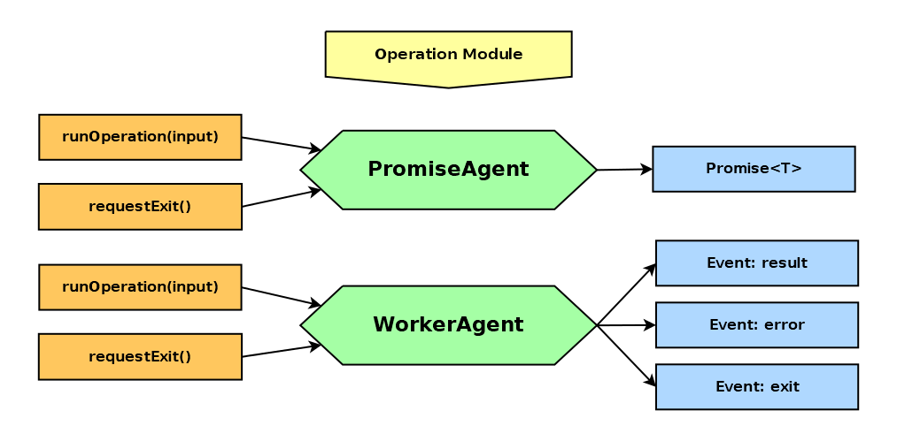

# worker-agent

_Typesafe wrapper for worker threads_


[](https://badge.fury.io/js/@giancosta86%2Fworker-agent)
[](/LICENSE)



**worker-agent** is a TypeScript wrapper designed to _simplify interactions with worker threads in NodeJS_; actually, it implements a fairly common _Erlang/Elixir_ pattern: the sophisticated _messaging protocol_ is hidden behind a higher-level but still _efficient_ abstraction layer - which is also _strongly typed_, in this case.

## Installation

```bash
npm install @giancosta86/worker-agent
```

or

```bash
yarn add @giancosta86/worker-agent
```

The public API entirely resides in the root package index, so you shouldn't reference specific modules.

## Usage

1. Create a module - an **operation module**, in **worker-agent**'s parlance - that:

   - can import names from _any other module or package_

   - should only export your **operation** - that is, a single _function_; in TypeScript, the function **must** be exported via `export = myFunction`

   The _operation_ function should be:

   - with an _arbitrary name_

   - with _at most one parameter_ - of arbitrary name and type

   - returning _an arbitrary type_, including a `Promise`

   - _throwing errors_ when needed

   For example, to declare a _synchronous function_:

   ```typescript
   function add40(value: number): number {
     return value + 40;
   }

   export = add40;
   ```

   and to declare an _asynchronous function_:

   ```typescript
   import { someAsyncFunction } from "some-package";

   async function specialSum(value: number): Promise<number> {
     const temp = await someAsyncFunction(value);
     return temp + value + 100;
   }

   export = specialSum;
   ```

1. Create a new instance of `WorkerAgent<TInput, TOutput>`, passing the path to the operation module: this will start a new worker thread, driven by the agent.

   Furthermore:

   - `TInput` should be the type of the parameter expected by the _operation_

   - `TOutput` should be the operation's _return type_ - or the type `T` wrapped by its `Promise<T>`

   For example:

   ```typescript
   import { join } from "node:path";

   const agent = new WorkerAgent<number, number>(join(__dirname, "my-sum"));
   ```

1. **Subscribe to events**; to register an event listener, you can call either `.on(...)` or `.once(...)` - as usual in NodeJS.

   The available events are:

   - **result**: the most important event - the one actually _returning output values and errors from the operation function_ called by the worker thread.

     The expected listener is a standard _error-first callback_ - a `(err: Error | null, output: TOutput | null) => void` function.

     For example:

     ```typescript
     agent.on("result", (err, output) => {
       if (err) {
         //Process the error
         return;
       }

       //Process the output
     });
     ```

   - **error**: sent whenever an _non-operational_ error occurs within the worker thread - for example, because it couldn't find the operation module. It expects a `(error: Error) => void` callback.

     **Please note**: errors thrown by the operation do _not_ trigger **error** events - instead, they are passed to the error-first callback of the **result** event

   - **exit**: sent by the worker thread _upon termination_, even after an **error** event. It takes a `(exitCode: number) => void` callback

1. **Start sending input data** - by calling `runOperation(input: TInput)`: every call will send a message to the worker thread queue - passing the given input, ready to be processed by the _operation_ exported by the _operation module_.

   For example:

   ```typescript
   agent.runOperation(90);
   ```

   It is a `void` method - because results - _both output values and errors_ - will be returned later, via the **result** event.

   You can send _multiple operation requests_: they are enqueued by the worker thread, ready to be processed one at a time.

1. Finally, don't forget to call `requestExit()` to send an _exit_ message to the worker thread's queue.

   **Please, note**: calling `requestExit()` enqueues a termination message that will be evaluated _as soon as all the previously-enqueued synchronous operations have completed_; however, for performance reasons, _no check is performed on asynchronous operations_ - so they will probably remain unfulfilled! Consequently, it is up to you, in your client code, to ensure that _all the async operations have settled_ **before** calling `requestExit()`.

   A possible solution to the above issue may consist in a counter that is incremented when calling `runOperation()` and decremented within the **result** event callback.

## Further reference

For additional examples, please consult the test suites in the source code repository.
